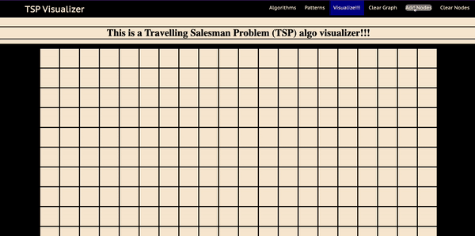
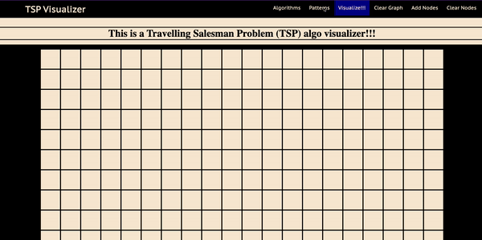
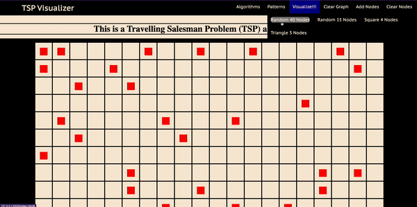
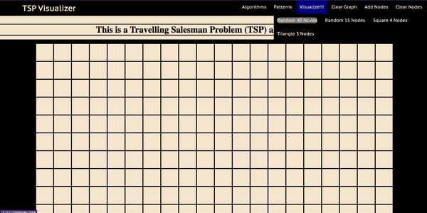
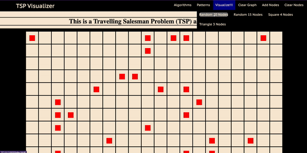

# TSP
A Travelling Salesman Problem Visualizer for Minimum Spanning Trees, TSP Heurestics, and TSP Solvers

---------------------------------------------------------------------------------------------------------------
This is a project done use vanilla JS for me to teach the TSP algorithm to other students. 
It highlights the specific way in which the algorithms find TSP heurisitcs, as it is a great way to contrast various heuristics

1. click on the boxes to select nodes or use preset randomized nodes
2. choose and algorithm
3. visualize!

https://weiceica.github.io/TSP/

# Add Node
To add a singular node, we could just click the square that we want to add a node on. 

# Randomize Node
To randomize nodes, we click the pattern button and choose what kind of random nodes we want.

# MST

# NI Heurestic

# 2-opt algorithm

